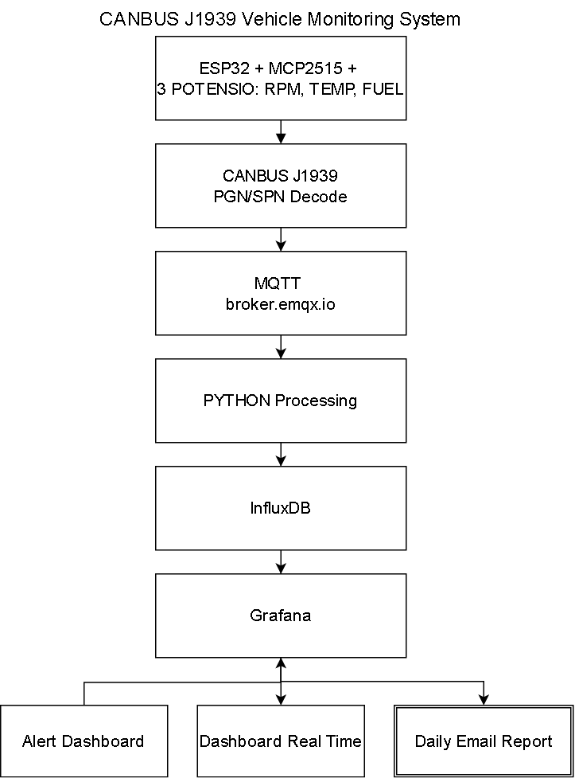
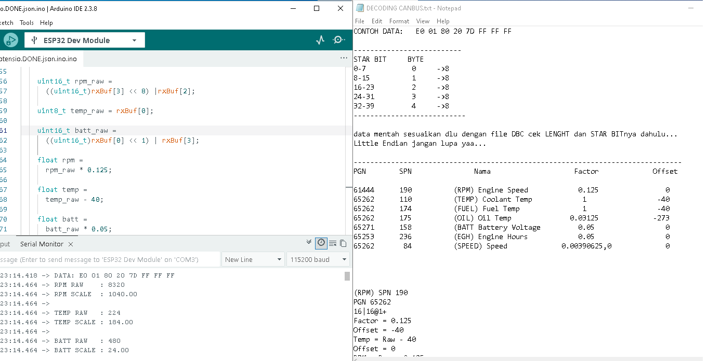
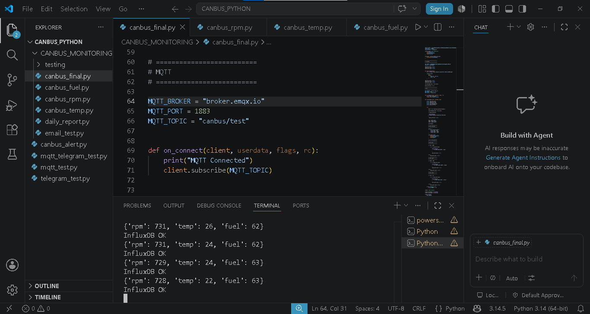
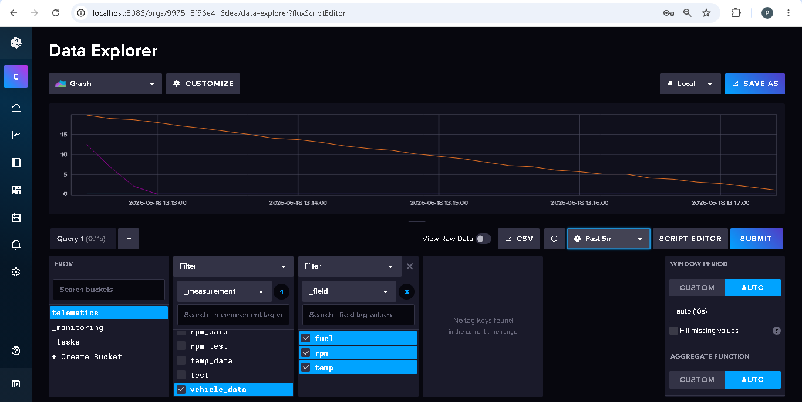
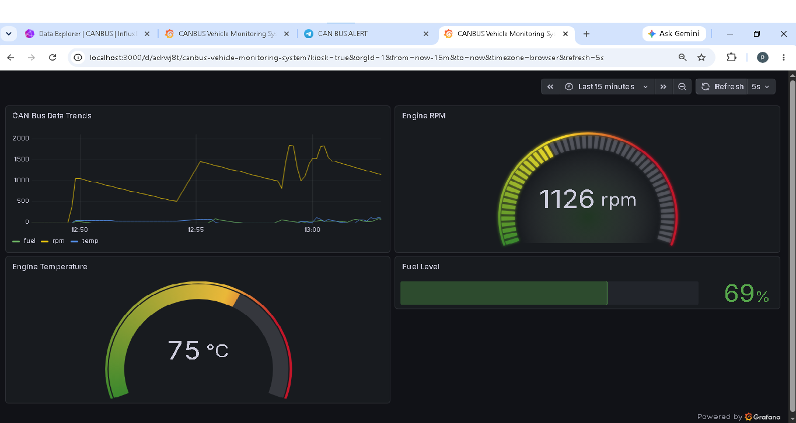
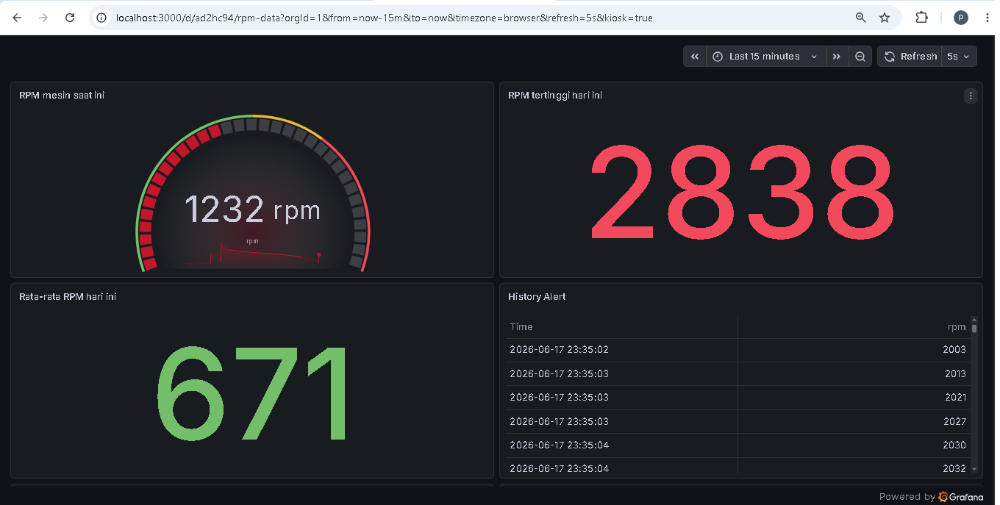
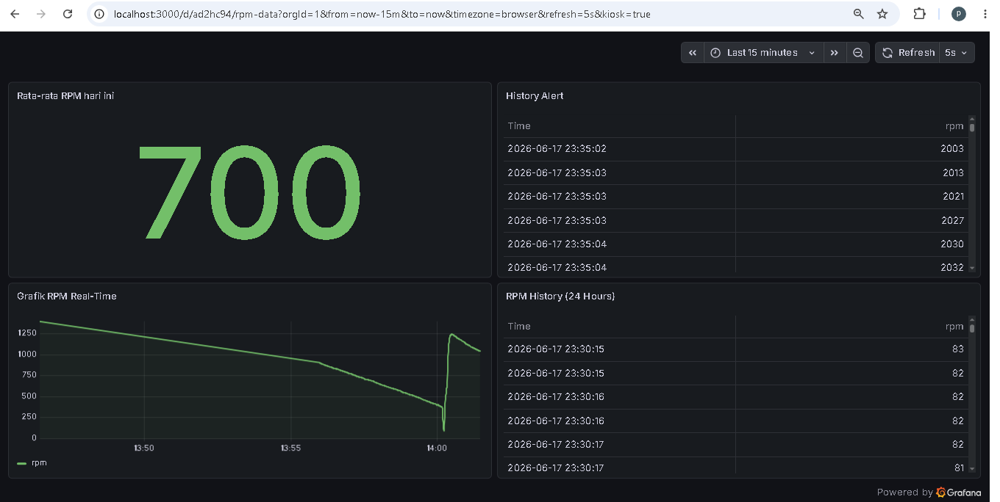
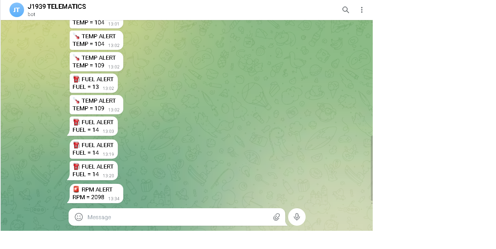
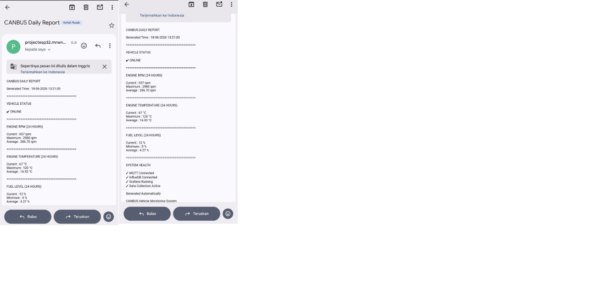

# 🚜 Vehicle Monitoring System J1939

CANBUS J1939 Vehicle Monitoring System using MQTT, Python, InfluxDB, Grafana, Telegram Alert and Daily Email Report

## Overview

This project was built to learn CANBUS SAE J1939 and basic telematics systems.

Saya mulai dari belajar konsep PGN, SPN, Start Bit, Length, Scaling Factor, Offset, dan Little Endian pada CANBUS J1939. Setelah memahami proses decoding data CANBUS, saya membuat simulasi vehicle monitoring system menggunakan ESP32, MCP2515, MQTT, Python, InfluxDB, Grafana, Telegram Alert, dan Daily Email Report.
Data RPM, Temperature, dan Fuel disimulasikan menggunakan 3 potentiometer. Data tersebut dikirim melalui MQTT, diproses menggunakan Python, disimpan ke InfluxDB, kemudian ditampilkan pada Grafana Dashboard secara real-time.

Project ini berfokus pada pemahaman proses decoding CANBUS J1939 serta implementasi alur data telematics sederhana mulai dari data acquisition, processing, storage, visualization, hingga alert notification.
---

## Project Highlights

- CANBUS SAE J1939 Decoding & PGN/SPN Analysis
- ESP32 + MCP2515 Vehicle Data Simulation
- MQTT Telemetry Communication
- Python Data Processing & Monitoring
- InfluxDB Time-Series Database
- Grafana Real-Time Dashboard
- Telegram Alert Notification
- Daily Email Report Automation
- CANBUS Message Investigation & Validation.

---

## Features

- CANBUS J1939 PGN/SPN Decoding
- ESP32 Sender & Receiver Communication
- MQTT Data Transmission
- Python MQTT Subscriber
- InfluxDB Data Storage
- Grafana Real-Time Dashboard
- RPM, Temperature and Fuel Monitoring
- Telegram Alert Notification
- Daily Email Report
- CANBUS Message Investigation & Validation

---

## System Architecture

---

## Technologies

- ESP32
- MCP2515 CANBUS Module
- Arduino IDE
- CANBUS SAE J1939
- MQTT
- MQTTX
- EMQX Broker
- Python
- VS Code
- InfluxDB
- Grafana
- Telegram Bot
- SMTP Email

---

## Hardware 
-ESP32
-MCP2515
-3POTENSIOMETERS

## CANBUS J1939 Signals Used

- PGN 61444 - SPN 190 (Engine RPM)
- PGN 65262 - SPN 110 (Coolant Temperature)
- PGN 65262 - SPN 174 (Fuel Temperature)
- PGN 65262 - SPN 175 (Oil Temperature)
- PGN 65271 - SPN 158 (Battery Voltage)
- PGN 65253 - SPN 236 (Engine Hours)
  
Topics learned:

- PGN
- SPN
- Start Bit
- Length
- Endianness
- Scaling Factor
- Offset
- Raw CAN Decoding

---
## Comunication

---

## Software Implementation

---

## Database

---

## Dashboard

Dashboard displays:

---

## Notification
- Telegram
- SMTP Email

---

## Demo Videos

### Demo 1 - Vehicle Monitoring System Canbus
Menampilkan sistem monitoring kendaraan menggunakan ESP32, MQTT, Python, InfluxDB dan Grafana.
Fitur meliputi real-time dashboard, Telegram Alert, Device Offline Monitoring dan Daily Email Report.

https://drive.google.com/file/d/1mqGjV11kmgS-Nfb3fMuEY5UentAbEUOZ/view?usp=drivesdk

### Demo 2 - CANBUS J1939 Signal Decoding
Menampilkan proses decoding CANBUS SAE J1939 menggunakan ESP32 dan MCP2515.
Mencakup Raw CAN Data, PGN/SPN Analysis, Scaling Factor, Offset dan Little Endian untuk menghasilkan data RPM, Temperature dan Battery Voltase

https://drive.google.com/file/d/1EaeOMzpNLMM91omMFGJg3jjwWiXpYgkp/view?usp=drivesdk

## Demo 3 - Learning Journey (Node-RED & SQLite)
Dokumentasi tahap awal pengembangan project menggunakan Node-RED dan SQLite.
Mencakup MQTT, Node-RED, SQLite, SQLite History

https://drive.google.com/file/d/1CyV-6kXFwHmTgpQlI_nw35109WbvViyo/view?usp=drivesdk

---

## Learning Journey

- CANBUS Loopback Testing
Started with MCP2515 loopback mode to understand basic CAN communication.

- Sender and Receiver Communication
Built a simple CAN sender and receiver using ESP32 and MCP2515 modules.

- CAN Message Analysis
Captured and analyzed CAN frames to understand message structure.

- DBC Decoding Practice
Learned PGN, SPN, start bit, signal length, scaling factor and offset.

- Vehicle Monitoring System
Integrated MQTT, Python vscode, InfluxDB, Grafana, Telegram alerts and Daily Report into a simple telematics simulation.

---

## Future Improvements

- GPS Tracking Integration (NEO-6M)
- Real CANBUS Vehicle Interface
- Fleet Monitoring Dashboard
- Advanced Alert & Notification System
- Heavy Equipment Telematics Aplication

---

## Author
Marwan Saputra

Self-learning CANBUS SAE J1939, MQTT and Telematics Systems.
