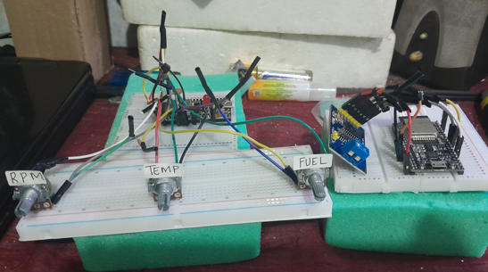
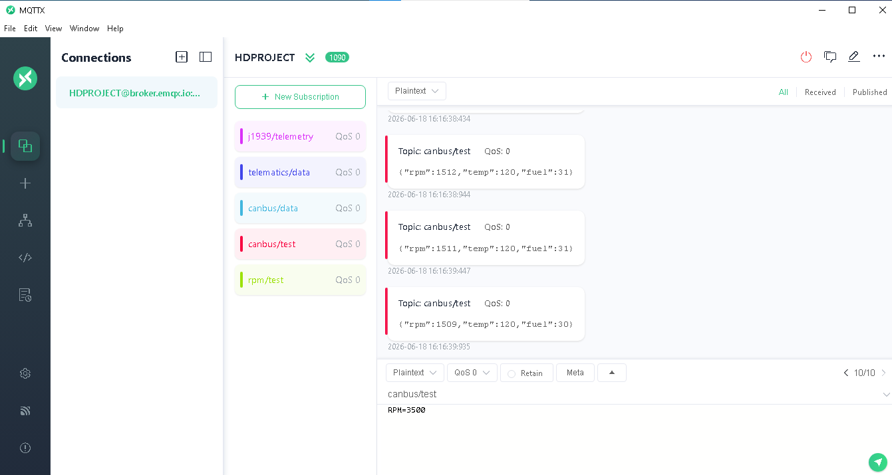
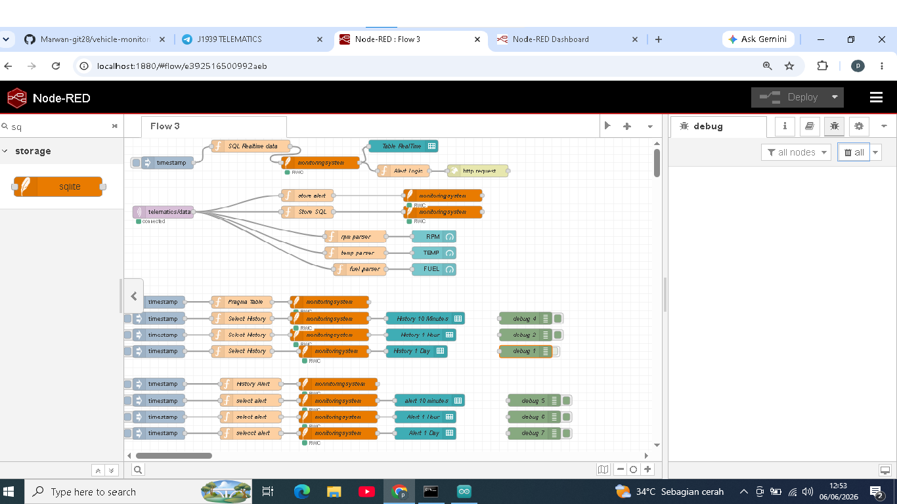
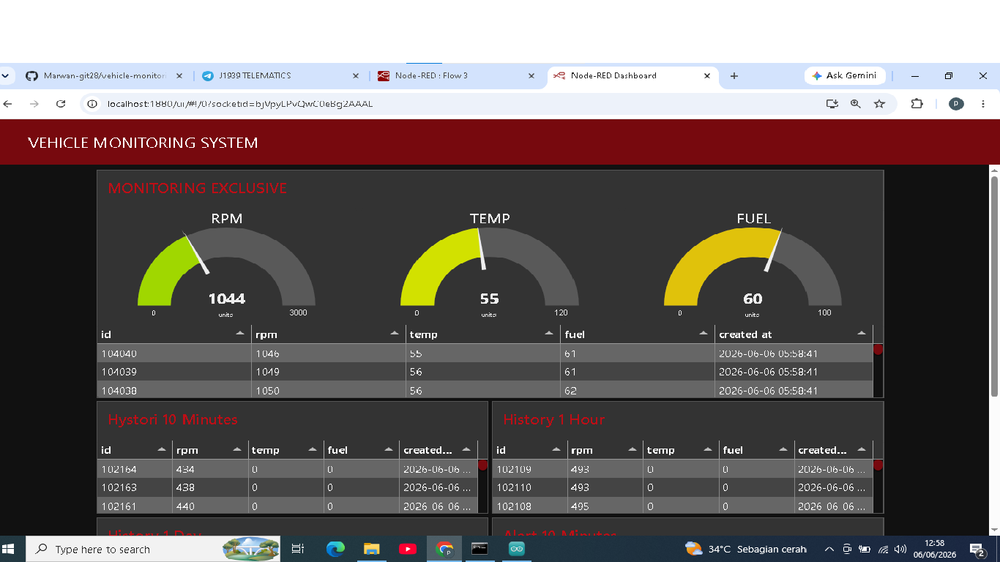
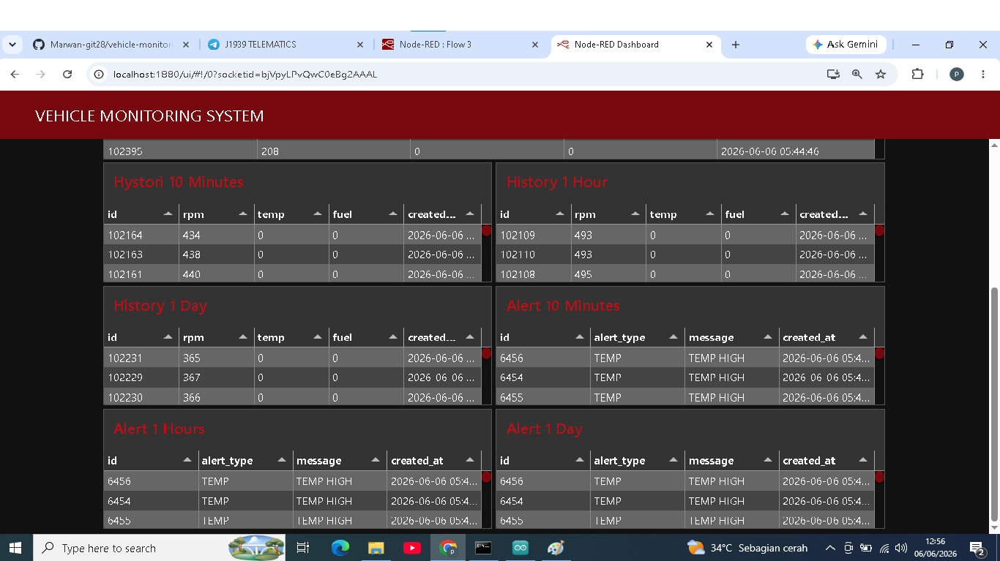
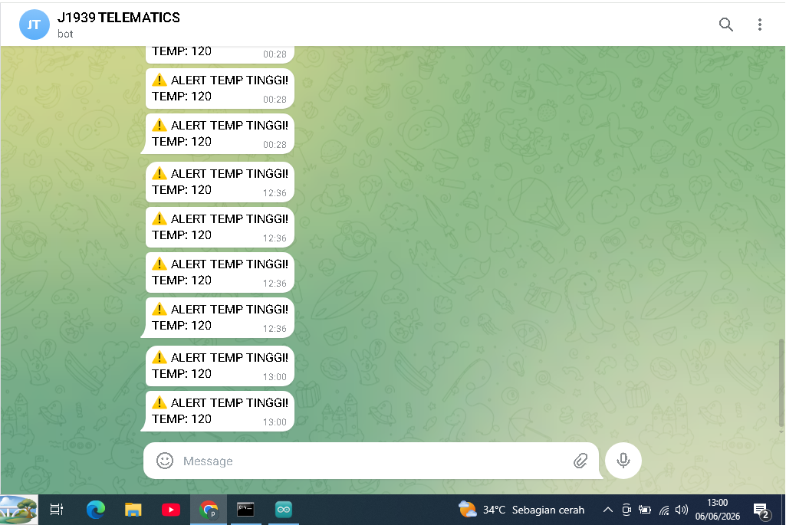

# 🚜 Vehicle Monitoring System J1939

CANBUS J1939 Vehicle Monitoring System using MQTT, Node-RED, SQLite and Telegram Alert

-

## Overview

This project was built to learn CANBUS SAE J1939 and basic telematics systems.
I started from learning PGN, SPN, start bit, signal length, scaling factor and offset. After understanding the decoding process, I built a simple vehicle monitoring system using Arduino, MQTT, Node-RED, SQLite and Telegram alerts.
Sensor values are simulated using potentiometers and sent through MQTT. The data is processed by Node-RED, stored in SQLite and displayed on a real-time dashboard.
The main focus of this project is understanding CANBUS J1939 decoding concepts such as PGN, SPN, start bit, signal length, scaling factor and offset.

---

## Features

- Real-Time Monitoring Dashboard
- MQTT Communication
- SQLite Data Logging
- History Monitoring (10 Minutes, 1 Hour, 1 Day)
- Alert History (10 Minutes, 1 Hour, 1 Day)
- Telegram Alert Notification
- CANBUS J1939 Decoding Study

---

## Learning Journey

- CANBUS Loopback Testing
Started with MCP2515 loopback mode to understand basic CAN communication.

- Sender and Receiver Communication
Built a simple CAN sender and receiver using ESP32 and MCP2515 modules.

- CAN Message Analysis
Captured and analyzed CAN frames to understand message structure.

- DBC Decoding Practice
Learned PGN, SPN, start bit, signal length, scaling factor and offset.

- Vehicle Monitoring System
Integrated MQTT, Node-RED, SQLite and Telegram alerts into a simple telematics simulation.

---

## System Architecture

Arduino + Potentiometers
Generate RPM, Temp, Fuel
↓
MQTTX
↓
broker.emqx.io
↓
Node-RED
↓
Dashboard Monitoring
↓
SQLite History
(10 Minutes, 1 Hour, 1 Day)
↓
Telegram Alert
(10 Minutes, 1 Hour, 1 Day)

---

## Technologies

- Arduino
- MQTT
- MQTTX
- EMQX
- Node-RED
- SQLite
- Telegram Bot
- CANBUS SAE J1939

---

## J1939 Signals Used

- PGN 61444 - SPN 190 (Engine RPM)
- PGN 65262 - SPN 110 (Coolant Temperature)
- PGN 65262 - SPN 174 (Fuel Temperature)
- PGN 65262 - SPN 175 (Oil Temperature)
- PGN 65271 - SPN 158 (Battery Voltage)
- PGN 65253 - SPN 236 (Engine Hours)
  
Topics learned:

- PGN
- SPN
- Start Bit
- Length
- Endianness
- Scaling Factor
- Offset
- Raw CAN Decoding

---

## Dashboard

Dashboard displays:

- RPM
- Temperature
- Fuel
- Historical Data
- Alert History
- Real-Time Monitoring

---

## Future Improvements

- Real CANBUS Interface
- GPS Tracking
- Fleet Monitoring
- Maintenance Analytics
- Heavy Equipment Telematics

---

## Author
Marwan Saputra

Self-learning CANBUS SAE J1939, MQTT and Telematics Systems.

## Hardware Setup

## MQTT Architecture

## Node-RED Flow

## Real Time Dashboard

## Historical Data

## Telegram Alert

